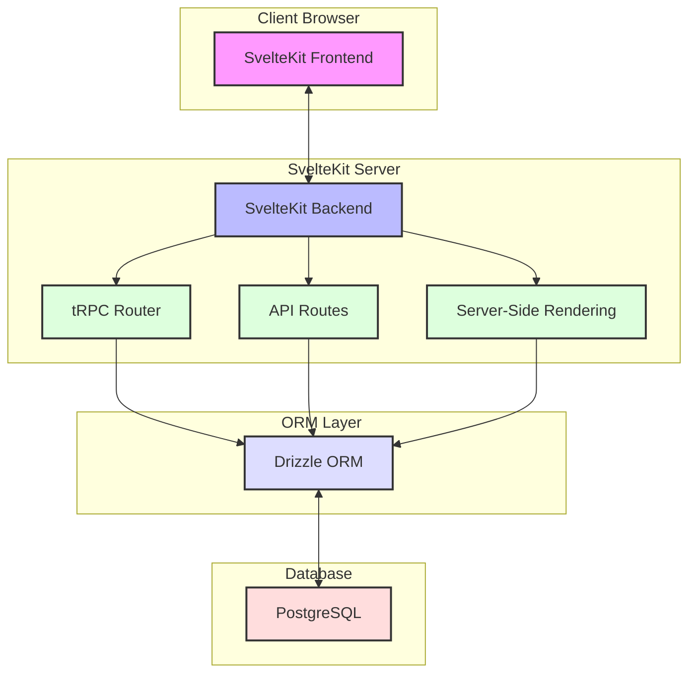

# taskmanager

**TODO**
- [ ] Fancy single project page
- [ ] Allow editing and deleting projects
- [ ] Task creation and Trello-like display
- [ ] Use Svelte 5 runes instead

## Architecture

This architecture provides several benefits:

Full-Stack TypeScript: SvelteKit, tRPC, and Drizzle all support TypeScript, ensuring type safety across the entire application.
Unified Backend and Frontend: SvelteKit allows you to keep your backend and frontend code in the same project, simplifying development and deployment.
Type-Safe API: tRPC provides end-to-end type safety for your API calls and uses the Drizzle table types, meaning if you change your db schema it will propagate all the way to your frontend.
Efficient Database Access: Drizzle ORM provides a type-safe and efficient way to interact with your PostgreSQL database.
Server-Side Rendering: SvelteKit's SSR capabilities improve initial load times and SEO.



---

## Developing

```bash
docker compose up
pnpm i
pnpm run db:migrate
```

Starts frontend and backend:
```bash
pnpm run dev
```

## Building

To create a production version of your app:

```bash
pnpm run build
```

You can preview the production build with `pnpm run preview`.

> To deploy your app, you may need to install an [adapter](https://kit.svelte.dev/docs/adapters) for your target environment.
